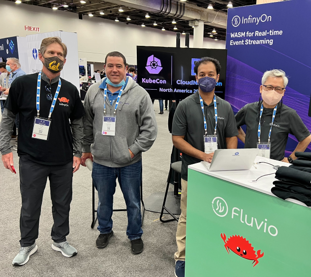
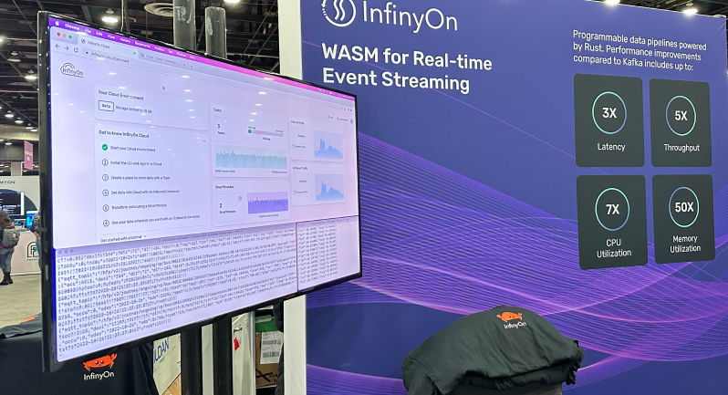

Fluvio is a distributed, programmable streaming platform written in Rust.

This Week in Fluvio is our weekly newsletter for development updates to [Fluvio open source].

---

## New release

* [Fluvio v0.10.0](https://github.com/infinyon/fluvio/releases/tag/v0.10.0)
* [`smdk` - SmartModule Development Kit CLI]
* [SQL outbound connector]

### Deprecations
The `fluvio connector` CLI and Fluvio's management of connectors has been
removed in this release.

You can still use local connectors with your local Fluvio cluster. For more
about local connectors see the [local connectors docs]

## New features

* SmartModule chaining ([#2618](https://github.com/infinyon/fluvio/pull/2618))
* SmartModule Development Kit CLI [(#2632](https://github.com/infinyon/fluvio/pull/2632))
  * SmartModule packages
* Add throughput control to Fluvio producer ([#2512](https://github.com/infinyon/fluvio/pull/2512))
* Added blocking on Producer if the batch queue is full ([#2562](https://github.com/infinyon/fluvio/pull/2562))

## Developer experience improvements

### SmartModule Development Kit
The SmartModule Development kit reduces the number of steps required to get started with developing new custom SmartModules using the `smdk` CLI.

[SmartModule Development Kit docs]

### SmartModule chaining preview
This release has a preview for SmartModule chaining. This functionality is offered with our Cloud [SQL outbound connector].

To see it in action, you can follow the following tutorials:

* [HTTP to SQL tutorial]
* [MQTT to SQL tutorial]

## InfinyOn Cloud updates

### New UI
A new version of the InfinyOn Cloud platform UI has been released. We've added the capability to view realtime info about your cluster.

Here's a quick preview

Check out the [New UI tutorial] for more information.

### Cloud connectors
Management of connectors is now exclusive to InfinyOn Cloud. You can create connectors in InfinyOn with the `fluvio cloud connector` CLI.

Check out the Cloud [connectors docs] for more info

### SmartModule Hub
SmartModule Hub is a new service for offering public SmartModules. This removes the requirement of installing a SmartModule development environment in order to take advantage of SmartModules. You can download SmartModules from the Hub directly to your cluster to use.

For developers, you can use `smdk` to publish SmartModules to the Hub to share publicly.

Check out the [SmartModule Hub docs] for more info

## Recent events

We launched the new InfinyOn Cloud platform at [KubeCon](https://events.linuxfoundation.org/kubecon-cloudnativecon-north-america/).

Thanks to those who were in attendance at KubeCon and stopped and said hi to us last week!

[`smdk` - SmartModule Development Kit CLI]: ../docs/fluvio/cli/smdk
[SQL outbound connector]: ../docs/hub/connectors/outbound/sql
[local connectors docs]: ../docs/hub/connectors
[SmartModule Development Kit docs]: ../docs/fluvio/cli/smdk
[HTTP to SQL tutorial]: ../docs/fluvio/tutorials/http-to-sql
[MQTT to SQL tutorial]: ../docs/fluvio/tutorials/mqtt-to-sql
[New UI tutorial]: /docs/cloud/how-to/use-infinyon-cloud
[connectors docs]: ../docs/hub/connectors
[SmartModule Hub docs]: ../docs/cloud/hub/overview

---

Get in touch with us on [Github Discussions] or join [our Discord channel] and come say hello! Watch videos on our [InfinyOn Youtube Channel]

For the full list of changes this week, be sure to check out [our CHANGELOG].

[Fluvio open source]: https://github.com/infinyon/fluvio
[our CHANGELOG]: https://github.com/infinyon/fluvio/blob/master/CHANGELOG.md
[our Discord channel]: https://discordapp.com/invite/bBG2dTz
[Github Discussions]: https://github.com/infinyon/fluvio/discussions
[InfinyOn Youtube Channel]: https://www.youtube.com/@InfinyOn
